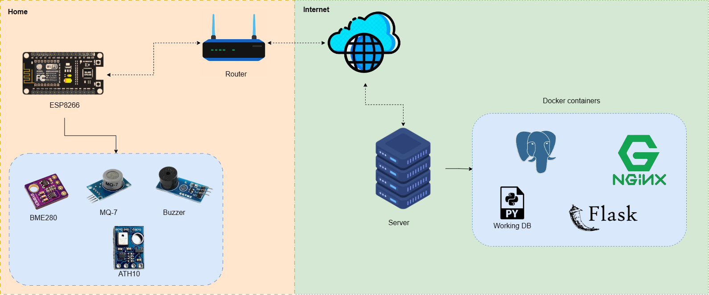
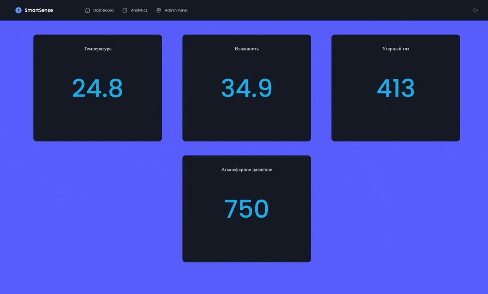
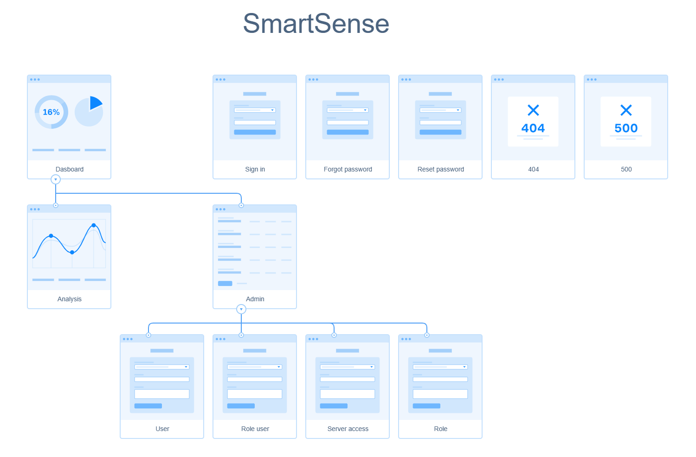
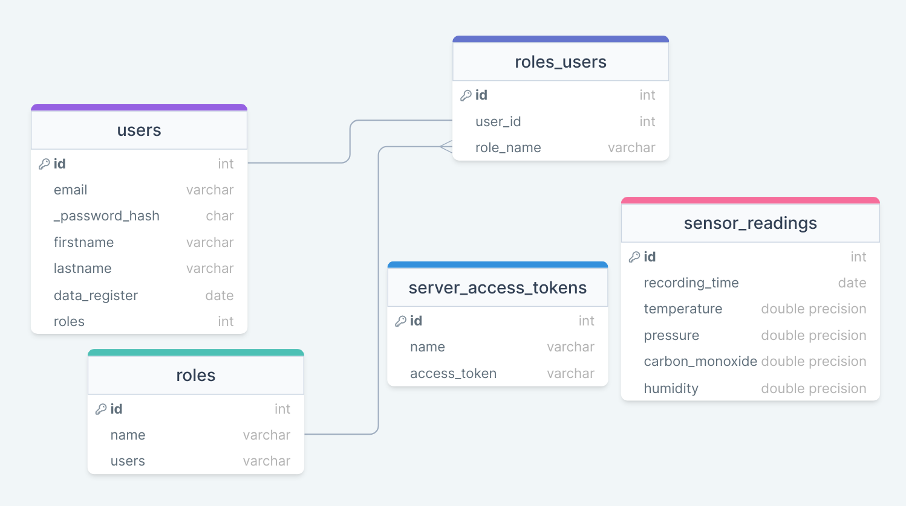

# SmartSense
## Introduction
The purpose of this project is to track the readings of the sensors in the room, which are sent from the station built on the basis of the ESP8266. The project consists of three main parts - this is a website for direct viewing of readings, a sectch with which the ESP8266 microcontroller is flashed and a server that receives data from the station and writes them to the database.

The development of all parts of the application was carried out in separate repositories
-   Sketch for ESP8266 firmware with a description of the settings https://github.com/stemirkhan/SmartSenseSketch/tree/main
- A server that receives data from the ESP8266 and writes it to the database https://github.com/stemirkhan/SmartSenseServer
- A site with a unified server for receiving data from the station, and docker files for quick deployment of all services https://github.com/stemirkhan/SmartSense




## Showcase



 ## Table of Contents


  - [Deployment](#deployment)
    - [Prodactions](#prodactions)
  - [Structure](#structure)
      - [Information Architecture](#information-architecture)
      - [Data Structure](#data-structure)


## Deployment

The first step is to clone the command line project.

``` Bash
git clone https://github.com/stemirkhan/SmartSense.git
```

Next, you need to set the environment variables in the track files.  
Environment variables in .env.prod.db file

```
POSTGRES_USER=
POSTGRES_PASSWORD=
POSTGRES_DB=
```  
Environment variables in the .env.prod file

```
TYPE_CONFIG=config.ProductionConfig

SECRET_KEY=

PRODUCTION_DATABASE_URI=postgresql://smart_sense:{psw}@db:5432/smart_sense

MAIL_SERVER=
MAIL_USERNAME=
MAIL_PASSWORD=

LEFT_USER_PSW=
LEFT_USER_EMAIL=

DATABASE=
SQL_HOST=
SQL_PORT=
```

Environment variables in the .env.prod.services file

```
SENSOR_READINGS_TABLE= 
ACCESS_TOKEN_TABLE=
USER_DB=
HOST_DB=
PORT_DB=
PASSWORD_DB=
DATABASE=
```

Site settings that are not set using environment variables can be set in the services/web/config.py file

``` Python

class ProductionConfig(BaseConfig):
    DEBUG = False
    SQLALCHEMY_DATABASE_URI = os.environ.get('PRODUCTION_DATABASE_URI')
    
    MAIL_SERVER = os.environ.get('MAIL_SERVER')
    MAIL_PORT = 465
    MAIL_USE_SSL = True
    MAIL_USERNAME = os.environ.get('MAIL_USERNAME')
    MAIL_PASSWORD = os.environ.get('MAIL_PASSWORD')
```

At the end, it remains to run the docker containers with the command:

``` Bash
docker-compose -f docker-compose.prod.yml up --build
```

## Structure

### Site structure



The picture shows the site map. After entering the site, the administrator can create users through the admin panel, as well as add an access token for stations. Thus, only the administrator can control the roles and tokens and adding users.

The main page of the site is a page with readings from sensors. The site also overrides 404 and 500 error pages.

### Data structure

